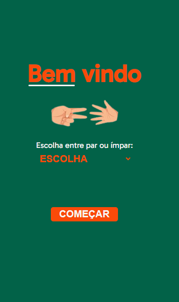
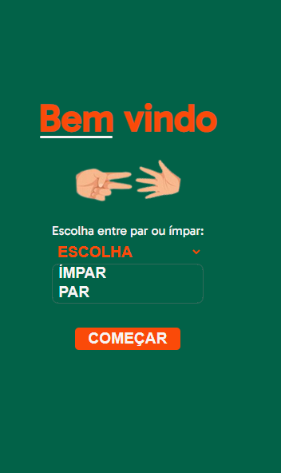
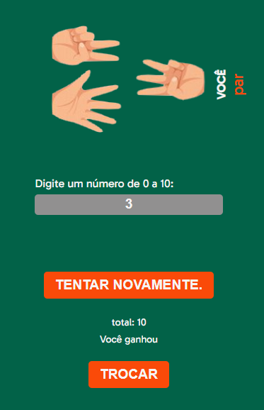

# JOGO PAR OU ÍMPAR

### O que faz?

##### - O usuário escolhe entre par ou ímpar na tela inicial.

##### - O usuário escolhe entre 0 a 10 na segunda tela e apertar o botão de jogar.

##### - O código irá sortea um número de 0 a 10.

##### - O resultado final com base na sua escolha inicial mostrá se o usuário perdeu ou ganhou.

## Design

### Tela inicial e tela inicial com opções:

### Tela inserir valor e tela resultado:

### Resultado:

[Clique aqui 😃](https://daniielluiiz.github.io/impar-ou-par/)

### Tecnologias usadas:

- HTML5
- JavaScript
- CSS

### O que aprendi/aprimorei?

- Lógica de programacão (melhorei)
- Validação de entradas em inputs(melhorado)
